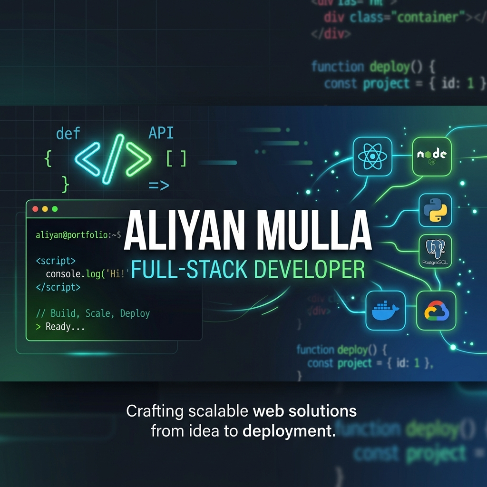

# Aliyan Mulla — Portfolio Website

A modern, responsive personal portfolio website built with **HTML, CSS, and JavaScript**.  
It highlights my profile, skills, experience, education, and contact details with a clean developer-focused UI and smooth interactions.



## Live Demo

## Features

1. Responsive one-page portfolio layout
2. Animated particle background with mouse interaction
3. Smooth scroll navigation and section-based structure
4. Mobile hamburger menu
5. Scroll reveal animations
6. Hero typing effect and animated counters
7. SEO + social sharing metadata (Open Graph and Twitter cards)
8. SPA-friendly routing support for static hosting

## Sections Included

- Hero
- About
- Skills & Tools
- Work Experience
- Education & Certifications
- Contact

## Tech Stack

- **HTML5**
- **CSS3** (custom properties, responsive design, animations)
- **Vanilla JavaScript** (DOM interactions, canvas animations, observers)
- **Nginx** (for containerized static serving)
- **Firebase Hosting** and **Google Cloud Run** deployment configs

## Project Structure

```text
.
├── index.html          # Main page markup
├── style.css           # Styling, layout, responsive rules, animations
├── script.js           # Interactivity and canvas effects
├── images/             # Favicon, preview, social image assets
├── firebase.json       # Firebase Hosting configuration
├── Dockerfile          # Container image setup (nginx)
├── nginx.conf          # SPA-friendly nginx config
└── cloudbuild.yaml     # Cloud Build + Cloud Run deployment pipeline
```

## Run Locally

Because this is a static website, you can run it with any static server.

### Option 1: VS Code Live Server

1. Open the folder in VS Code
2. Install the **Live Server** extension
3. Right-click `index.html` → **Open with Live Server**

### Option 2: Python HTTP Server

```bash
python3 -m http.server 8080
```

Then open: `http://localhost:8080`

## Deployment

### Firebase Hosting

The project includes `firebase.json` with SPA rewrites:

- Serves the repository root as static files
- Rewrites all routes to `index.html`

### Docker + Cloud Run

The repository includes:

- `Dockerfile` using `nginx:alpine`
- `nginx.conf` with `try_files` fallback for SPA routing
- `cloudbuild.yaml` to build, push, and deploy to Cloud Run

## Customization Guide

To personalize this portfolio:

1. Edit content in `index.html` (name, bio, experience, links)
2. Update colors/fonts/spacing in `style.css`
3. Tune effects (particles, typing text, counters) in `script.js`
4. Replace images inside `images/` (favicon, OG image, preview screenshot)

## Contact

- **Email:** aliyan.abdulraheem.mulla@gmail.com
- **Phone:** +91 7019224898
- **Location:** Bengaluru, India

---

Designed and built by **Aliyan Mulla**.
